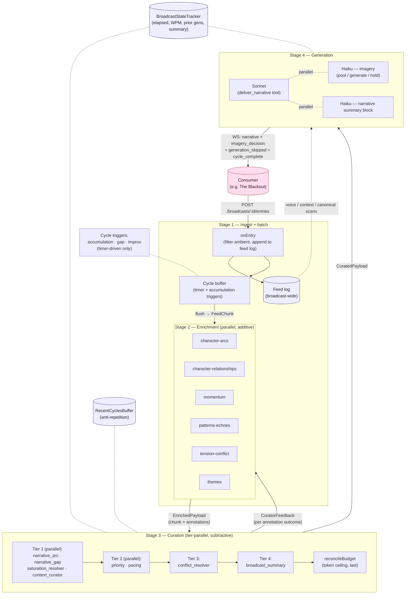

# Kairos — pipeline diagram

> **⚠️ Stale (2026-05-11).** This diagram shows "Curation (sequential)" (it's tier-parallel now) and the old `accumulation · gap · improv` trigger enum (collapsed to `accumulation · external`). The current architecture is in [`apps/kairos/server/src/README.md`](../apps/kairos/server/src/README.md). This file will be refreshed or retired with the rest of the Kairos doc decomposition.

The four-stage Kairos pipeline at a glance: ingest+batch → enrichment (parallel) → curation (sequential) → generation, with the curator-feedback loop and supporting state. Renders natively on GitHub, VSCode (with the Mermaid extension), and Cursor. The companion narrative doc is [`kairos-architecture.md`](./kairos-architecture.md).

