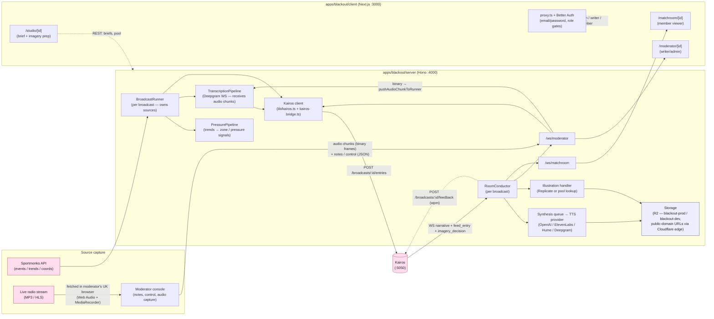

# The Blackout — system diagram

> **⚠️ Predates the Design-A matchroom-reveal bundle architecture (2026-05-11).** For the current consumer-side architecture see [`apps/blackout/server/README.md`](../apps/blackout/server/README.md) (which carries the source-capture + Kairos-feed pipeline diagrams) and the `apps/blackout/server/src/<module>/README.md` files. This file will be refreshed or retired with the rest of the consumer-side doc decomposition.

The consumer-side system at a glance: source capture → Kairos → conductor → web clients, plus the pacing feedback loop and auth gate. Renders natively on GitHub, VSCode (with the Mermaid extension), and Cursor. The companion narrative doc is [`the-blackout-architecture.md`](./the-blackout-architecture.md).

